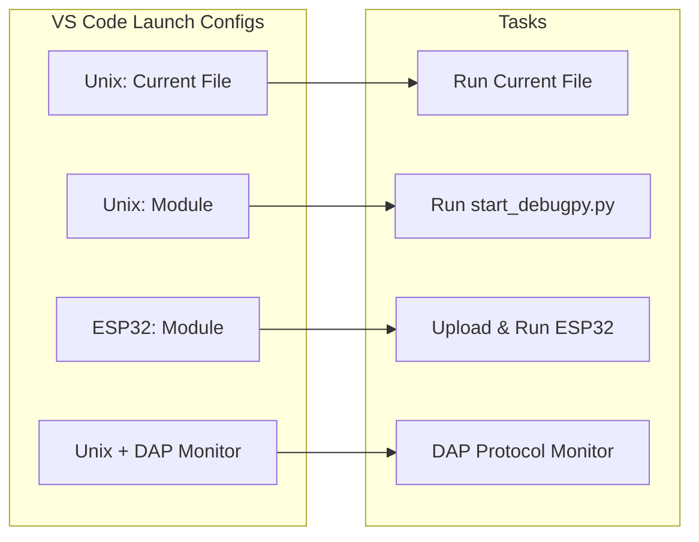

# MicroPython debugpy (Beta Code)

A minimal **experimental** implementation of debugpy for MicroPython, enabling remote debugging with VS Code and other Debug Adapter Protocol (DAP) compatible debuggers.

## Quick Start

### 1. Basic Setup

```python
import debugpy

# Start listening for debugger connections
host, port = debugpy.listen()  # Default: 127.0.0.1:5678
print(f"Debugger listening on {host}:{port}")

# Enable debugging for current thread
debugpy.debug_this_thread()

# Your code here...
def my_function():
    x = 10
    y = 20
    result = x + y  # Set breakpoint here in VS Code
    return result

result = my_function()
print(f"Result: {result}")
```

### 2. VS Code Configuration

Create a `.vscode/launch.json` file in your project:

```json
{
    "version": "0.2.0",
    "configurations": [
        {
            "name": "Attach to MicroPython",
            "type": "python",
            "request": "attach",
            "connect": {
                "host": "127.0.0.1",
                "port": 5678
            },
            "pathMappings": [
                {
                    "localRoot": "${workspaceFolder}",
                    "remoteRoot": "."
                }
            ],
            "justMyCode": false
        }
    ]
}
```

### 3. Start Debugging

1. Run your MicroPython script with debugpy
2. In VS Code, press `F5` or use "Run and Debug" to attach
3. Set breakpoints and debug as usual

## Hardware Setup

### Unix Port (Development)

Build MicroPython Unix port with debugging support:

```bash
cd ports/unix
make CFLAGS_EXTRA="-DMICROPY_PY_SYS_SETTRACE=1"
```

### ESP32 Setup

**To be reviewed** - *The firmware version and build configuration need verification*

Flash custom firmware with debugging enabled:

```bash
# Erase flash
esptool --chip esp32 --port /dev/ttyUSB0 erase_flash

# Flash firmware
esptool.py --chip esp32 --port /dev/ttyUSB0 -b 921600 write_flash --flash_mode keep --flash_size detect --compress 0x1000 firmware/build-ESP32_GENERIC/firmware.bin
```

**To be reviewed** - *Version information needs verification*
The firmware includes:
- MicroPython v1.26.0-preview.272.ga7c7a75eef.dirty
- `MICROPY_PY_SYS_SETTRACE = 1`
- `MICROPY_PY_SYS_SETTRACE_SAVE_NAMES = 1`

## Features

### Debugging Operations
- **Breakpoints**: Set and manage breakpoints in your code
- **Step Operations**: Step over/into/out of functions
- **Stack Inspection**: View call stack and frame information
- **Variable Inspection**: **To be reviewed** - *Contradictory statements about variable support*
- **Expression Evaluation**: Evaluate expressions in the current context
- **Pause/Continue**: Control execution flow

### Platform Support
- **Unix Port**: Full debugging support for development
- **ESP32**: Remote debugging over WiFi
- **VS Code Integration**: Semi-Complete DAP protocol support

## API Reference

### Core Functions

#### `debugpy.listen(port=5678, host="127.0.0.1")`
Start listening for debugger connections.
- **Parameters**: `port` (int), `host` (str)
- **Returns**: Tuple of (host, port) actually used

#### `debugpy.debug_this_thread()`
Enable debugging for the current thread by installing the trace function.

#### `debugpy.breakpoint()`
Trigger a manual breakpoint that will pause execution if a debugger is attached.

### Connection Management

#### `debugpy.wait_for_client()`
Wait for the debugger client to connect and initialize.

#### `debugpy.is_client_connected()`
Check if a debugger client is currently connected.
- **Returns**: Boolean indicating connection status

#### `debugpy.disconnect()`
Disconnect from the debugger client and clean up resources.

## Development Workflow

### Method 1: Direct Connection with Logging

```bash
# Start MicroPython with your script
firmware/unix_debug_enabled/micropython test_vscode.py

# Connect VS Code debugger to 127.0.0.1:5678
```

### Method 2: Using DAP Monitor (Recommended)

For detailed protocol analysis:

```bash
# Terminal 1: Start your MicroPython script
firmware/unix_debug_enabled/micropython test_vscode.py

# Terminal 2: Start DAP monitor
python3 micropython-lib/python-ecosys/debugpy/dap_monitor.py

# VS Code: Connect to port 5679 instead of 5678
```

The monitor shows all DAP message exchanges:
```
[DAP] RECV: request initialize (seq=1)
[DAP]   args: {...}
[DAP] SEND: response initialize (req_seq=1, success=True)
```

### Launch Tasks Configuration

The workspace includes several predefined tasks for different scenarios:



## Troubleshooting

### Common Issues

1. **Connection Failures**: Ensure MicroPython is listening before connecting VS Code
2. **Breakpoint Issues**: Check that `sys.settrace` support is enabled in firmware
3. **Variable Inspection**: **To be reviewed** - *Behavior depends on configuration flags that may be inconsistent*

### Debug Logging

Enable VS Code's DAP logging:
1. Open VS Code settings (Ctrl+,)
2. Search for `debug.console.verbosity`
3. Set to `verbose`
4. Set `debug.allowBreakpointsEverywhere` to `true`

### Expected DAP Sequence

A successful debug session follows this sequence:
1. `initialize` → capabilities response
2. `initialized` event
3. `setBreakpoints` → verified breakpoints
4. `configurationDone` → ready
5. `attach` → connected
6. On breakpoint: `stopped` event
7. `stackTrace` → frame information
8. `scopes` → variable scopes

## Architecture

### Core Components

1. **Public API** ([`public_api.py`](micropython-lib/python-ecosys/debugpy/debugpy/public_api.py)): User-facing functions
2. **Debug Session** ([`debug_session.py`](micropython-lib/python-ecosys/debugpy/debugpy/server/debug_session.py)): DAP protocol handler
3. **PDB Adapter** ([`pdb_adapter.py`](micropython-lib/python-ecosys/debugpy/debugpy/server/pdb_adapter.py)): Trace system bridge
4. **Messaging** ([`messaging.py`](micropython-lib/python-ecosys/debugpy/debugpy/common/messaging.py)): JSON/DAP messages
5. **Constants** ([`constants.py`](micropython-lib/python-ecosys/debugpy/debugpy/common/constants.py)): Protocol definitions

### Enhanced Variable Inspection

The implementation includes advanced local variable introspection through MicroPython's enhanced `sys.settrace()` functionality:

#### Basic Frame Access
- `frame.f_locals` provides access to local variables
- Memory-safe with GC lock checking
- Fallback to generic names (`local_01`, `local_02`) when needed

#### Advanced Name Preservation
When variable name preservation is enabled:
- Actual variable names are preserved in bytecode
- Variables appear with real names: `{'foo': 'hello', 'bar': 123}`
- Reverse slot assignment ensures correct variable-to-slot mapping

#### MicroBython Build Configuration Options

To enable debugging features, ensure the following flags are set:

```sh
make -C ports/unix CFLAGS_EXTRA="-DMICROPY_PY_SYS_SETTRACE=1 -DMICROPY_PY_SYS_SETTRACE_SAVE_NAMES=1"
make -C ports/unix CFLAGS_EXTRA="-DMICROPY_PY_SYS_SETTRACE=1 -DMICROPY_PY_SYS_SETTRACE_SAVE_NAMES=1"
```

```c
// Required for basic debugging
#define MICROPY_PY_SYS_SETTRACE (1)

// Enhanced variable name preservation (method 1 - [PR#4](https://github.com/andrewleech/micropython/pull/4))
#define MICROPY_PY_SYS_SETTRACE_SAVE_NAMES (1)

// Alternative broader support (method 2 - [PR#5](https://github.com/andrewleech/micropython/pull/5))
#define MICROPY_SAVE_LOCAL_VARIABLE_NAMES (1)


```

## Requirements

- **MicroPython**: Built with `MICROPY_PY_SYS_SETTRACE=1`
- **Socket Support**: For network communication
- **JSON Support**: For DAP message parsing
- **Memory**: Minimal overhead (~4 bytes per local variable mapping)

## Limitations
This is a minimal implementation with these current limitations:

- Single-threaded debugging only
- No conditional breakpoints
- No function breakpoints
- Limited nested object expansion
- No step back functionality
- No hot code reloading

- **Variable inspection support varies by configuration** - may show generic names or real names
- 
- Maximum 32 local variables per stackFrame (configurable at compile time)

## Compatibility

### Tested Platforms
- MicroPython Unix port
- MicroPython ESP32 port
- VS Code with Python/debugpy extension
- CPython 3.x (for comparison)

### Backward Compatibility **[ TO BE VERIFIED ]**
- Works with or without variable name preservation
- Progressive enhancement as more features are enabled
- Existing code continues to work without modification

## Contributing

This implementation provides a foundation for MicroPython debugging. 
Contributions welcome for:

- Conditional breakpoint support
- Enhanced variable inspection
- Multi-threading support
- Performance optimizations
- Additional DAP protocol features
- More hardware platform support

**Note:** 
 - Contributions for features should go directly to the MicroPython and micropython-lib repositories (or existing PRs) 
 - If you have samle configurations or tests or additional firmwares, they are welcome here 


## References

- https://github.com/microsoft/debugpy/wiki/Debug-configuration-settings

## License

MIT License - see the MicroPython project license for details.