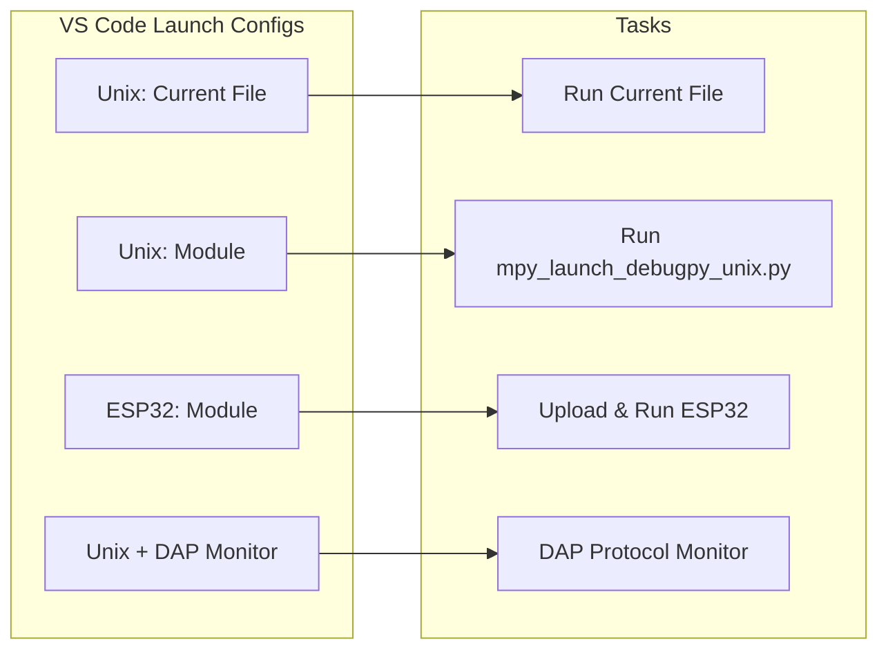

# MicroPython debugpy (Beta Code)

A minimal **experimental** implementation of debugpy for MicroPython, enabling remote debugging with VS Code and other Debug Adapter Protocol (DAP) compatible debuggers.

The setup of this configuration is rather complex as it requires Open PRs across multiple repos to implement, 
and there are multiple variations and features tested out.

This Repo uses git submodules to link to the relevant PRs in the MicroPython and MicroPython-lib repositories, and contains the sample code, configurations, and documentation for using VSCode and debugpy with MicroPython.
```
[submodule "micropython"]
	path = micropython
	url = https://github.com/josverl/micropython.git
	branch = pdb_support_jos

[submodule "micropython-lib"]
	path = micropython-lib
	url = https://github.com/josverl/micropython-lib.git
	branch = debugpy/jos
```


- MicroPython repo

    The `josverl/micropython/pdb_support_jos` branch is based on : 

    [MicroPython-PR8767](https://github.com/micropython/micropython/pull/8767) Improve sys.settrace to help support debugpy / pdb debugging

    and contains additional features :
        - inspection of local variables (with or without name preservation, depending on the configuration flags)

    You need to build a firmware for the relevant port/board/variant with `MICROPY_PY_SYS_SETTRACE=1` enabled


- Micropython Lib repo

    The `josverl/micropython-lib/debugpy/jos` branch is based on :

    [MicroPython-lib-PR#1022](https://github.com/micropython/micropython-lib/pull/1022) - python-ecosys/debugpy: Add VS Code debugging support for MicroPython.
        This PR implements the debugpy module, allowing DAP debuggers such as VSCode to connect to MicroPython for debugging sessions. 
        The implementation includes support for breakpoints, stepping, stack inspection, and variable modification.

    the branch contains the additional features:
    - debugpy
        - handle complex variables ( objects, lists, dicts) with limited expansion )
        - handle bare meatal ports ( ESP32 )
        - improve path mapping between host and target
        - Add Pause functionality to interrupt Pauze running code
        - Allow setting/changing global and local variables on the debug target 
        - performance improvements
            - optimize breakpoint handling
            - Use `const()` to define DAP strings
            - avoid method access
    - dab Monitor
        - add cli to handle different ports/boards


    This module is not frozen into the firmware by default, but could be included in custom builds.
    to use the debugpy module, you need to : 

    - install it to your MCU or make it available in the path for the unix builds
        ```
        python launcher/compile_debugpy.py
        mpremote mip install launcher/debugpy_mpy.json
        ```
    I suggest using the cross-compiled version to save memory and reduce the time spent on compilation on the device, but you can also use `mpremote mip install launcher/debugpy.json` for the uncompiled version if you prefer.

- This repo contains the sample code, configurations, and documentation for using VSCode and debugpy with MicroPython. 

    in order to debug MicroPython code with VS Code, you need to:
    - load the firmware on an MCU 
    - install the ``debugpy`` module to the MCU 
    - have your source code copied to the MCU (does not work with mpremote mount, you need to copy the files to the MCU filesystem )
    - have the MCU connected to a network that your development machine can access (for remote debugging)
    - start the debugpy and set a breakpoint, either using `mpremote run mpy_launch_debug,xxx.py` , or by setting this up in your code 
    - and connect to it from VS Code

    The debug configurations need to properly correlate the (different) locations of the source files 
    - on the host machine (VS Code) ( the workspace folder /src)
    - and on the target (The root of the filesystem, or a subfolder) 

## Quick Start

### 1. Basic Setup

- Build and flash MicroPython firmware with `MICROPY_PY_SYS_SETTRACE=1` enabled
- Install `debugpy` module on the target device
- Copy your source code to the target device (e.g., using `mpremote cp`)
- Ensure the target device is network-accessible (connected to WiFi / LAN ) for remote debugging

### 2. on debug target: Wait for debugger

```python
import debugpy

# Start listening for debugger connections
host, port = debugpy.listen()  # Default: 127.0.0.1:5678
print(f"Debugger listening on {host}:{port}")

# Enable debugging for current thread
debugpy.debug_this_thread()

# Your code here...
def my_function():
    x = 10
    y = 20
    result = x + y  # Set breakpoint here in VS Code
    return result

result = my_function()
print(f"Result: {result}")
```

### 2. VS Code Configuration

Create a `.vscode/launch.json` file in your project:

```json
{
    "version": "0.2.0",
    "configurations": [
        {
            "name": "Attach to MicroPython",
            "type": "python",
            "request": "attach",
            "connect": {
                "host": "127.0.0.1",
                "port": 5678
            },
            "pathMappings": [
                {
                    "localRoot": "${workspaceFolder}",
                    "remoteRoot": "."
                }
            ],
            "justMyCode": false
        }
    ]
}
```

### 3. Start Debugger from Host and connect to the target

1. Run your MicroPython script with debugpy
2. In VS Code, press `F5` or use "Run and Debug" to attach
3. Set breakpoints and debug as usual

## Hardware Setup

### Unix Port (Development)

Build MicroPython Unix port with debugging support:

```bash
# check put the correct forek/branch 
cd micropython 
cd ports/unix
make CFLAGS_EXTRA="-DMICROPY_PY_SYS_SETTRACE=1"
```

### ESP32 Setup

**To be reviewed** - *The firmware version and build configuration need verification*

Flash custom firmware with debugging enabled:

```bash
# Erase flash
esptool --chip esp32 --port /dev/ttyUSB0 erase_flash

# Flash firmware
esptool.py --chip esp32 --port /dev/ttyUSB0 -b 921600 write_flash --flash_mode keep --flash_size detect --compress 0x1000 firmware/build-ESP32_GENERIC/firmware.bin
```

**To be reviewed** - *Version information needs verification*
The firmware includes:
- MicroPython v1.26.0-preview.272.ga7c7a75eef.dirty
- `MICROPY_PY_SYS_SETTRACE = 1`
- `MICROPY_PY_SYS_SETTRACE_SAVE_NAMES = 1`

## Features

### Debugging Operations
- **Breakpoints**: Set and manage breakpoints in your code
- **Step Operations**: Step over/into/out of functions
- **Stack Inspection**: View call stack and frame information
- **Variable Inspection**: **To be reviewed** - *Contradictory statements about variable support*
- **Expression Evaluation**: Evaluate expressions in the current context
- **Pause/Continue**: Control execution flow

### Platform Support
- **Unix Port**: Full debugging support for development
- **ESP32**: Remote debugging over WiFi
- **VS Code Integration**: Semi-Complete DAP protocol support

## API Reference

### Core Functions

#### `debugpy.listen(port=5678, host="127.0.0.1")`
Start listening for debugger connections.
- **Parameters**: `port` (int), `host` (str)
- **Returns**: Tuple of (host, port) actually used

#### `debugpy.debug_this_thread()`
Enable debugging for the current thread by installing the trace function.

#### `debugpy.breakpoint()`
Trigger a manual breakpoint that will pause execution if a debugger is attached.

### Connection Management

#### `debugpy.wait_for_client()`
Wait for the debugger client to connect and initialize.

#### `debugpy.is_client_connected()`
Check if a debugger client is currently connected.
- **Returns**: Boolean indicating connection status

#### `debugpy.disconnect()`
Disconnect from the debugger client and clean up resources.

## Development Workflow

### Method 1: Direct Connection with Logging

```bash
# Start MicroPython with your script
firmware/unix_debug_enabled/micropython test_vscode.py

# Connect VS Code debugger to 127.0.0.1:5678
```

### Method 2: Using DAP Monitor (Recommended)

For detailed protocol analysis:

```bash
# Terminal 1: Start your MicroPython script
firmware/unix_debug_enabled/micropython test_vscode.py

# Terminal 2: Start DAP monitor
python3 micropython-lib/python-ecosys/debugpy/dap_monitor.py

# VS Code: Connect to port 5679 instead of 5678
```

The monitor shows all DAP message exchanges:
```
[DAP] RECV: request initialize (seq=1)
[DAP]   args: {...}
[DAP] SEND: response initialize (req_seq=1, success=True)
```

### Launch Tasks Configuration

The workspace includes several predefined tasks for different scenarios:


```mermaid
flowchart LR
    subgraph VS Code Launch Configs
        l_unix_file["Unix: Current File"]
        l_unix_module["Unix: Module"]
        l_esp32_module["ESP32: Module"]
        l_unix_monitor["Unix + DAP Monitor"]
    end

    subgraph Tasks
        mp_unix_file["Run Current File"]
        mp_unix_launcher["Run mpy_launch_debugpy_unix.py"]
        mp_esp32_upload["Upload & Run ESP32"]
        DAP_monitor["DAP Protocol Monitor"]
    end

    l_unix_file --> mp_unix_file
    l_unix_module --> mp_unix_launcher
    l_esp32_module --> mp_esp32_upload
    l_unix_monitor --> DAP_monitor
```

## Troubleshooting

### Common Issues

1. **Connection Failures**: Ensure MicroPython is listening before connecting VS Code
2. **Breakpoint Issues**: Check that `sys.settrace` support is enabled in firmware
3. **Variable Inspection**: **To be reviewed** - *Behavior depends on configuration flags that may be inconsistent*

### Debug Logging

Enable VS Code's DAP logging:
1. Open VS Code settings (Ctrl+,)
2. Search for `debug.console.verbosity`
3. Set to `verbose`
4. Set `debug.allowBreakpointsEverywhere` to `true`

### Expected DAP Sequence

A successful debug session follows this sequence:
1. `initialize` → capabilities response
2. `initialized` event
3. `setBreakpoints` → verified breakpoints
4. `configurationDone` → ready
5. `attach` → connected
6. On breakpoint: `stopped` event
7. `stackTrace` → frame information
8. `scopes` → variable scopes

## Architecture

### Core Components

1. **Public API** ([`public_api.py`](micropython-lib/python-ecosys/debugpy/debugpy/public_api.py)): User-facing functions
2. **Debug Session** ([`debug_session.py`](micropython-lib/python-ecosys/debugpy/debugpy/server/debug_session.py)): DAP protocol handler
3. **PDB Adapter** ([`pdb_adapter.py`](micropython-lib/python-ecosys/debugpy/debugpy/server/pdb_adapter.py)): Trace system bridge
4. **Messaging** ([`messaging.py`](micropython-lib/python-ecosys/debugpy/debugpy/common/messaging.py)): JSON/DAP messages
5. **Constants** ([`constants.py`](micropython-lib/python-ecosys/debugpy/debugpy/common/constants.py)): Protocol definitions

### Enhanced Variable Inspection

The implementation includes advanced local variable introspection through MicroPython's enhanced `sys.settrace()` functionality:

#### Basic Frame Access
- `frame.f_locals` provides access to local variables
- Memory-safe with GC lock checking
- Fallback to generic names (`local_01`, `local_02`) when needed

#### Advanced Name Preservation
When variable name preservation is enabled:
- Actual variable names are preserved in bytecode
- Variables appear with real names: `{'foo': 'hello', 'bar': 123}`
- Reverse slot assignment ensures correct variable-to-slot mapping

#### MicroBython Build Configuration Options

To enable debugging features, ensure the following flags are set:

```sh
make -C ports/unix CFLAGS_EXTRA="-DMICROPY_PY_SYS_SETTRACE=1 -DMICROPY_PY_SYS_SETTRACE_SAVE_NAMES=1"
make -C ports/unix CFLAGS_EXTRA="-DMICROPY_PY_SYS_SETTRACE=1 -DMICROPY_PY_SYS_SETTRACE_SAVE_NAMES=1"
```

```c
// Required for basic debugging
#define MICROPY_PY_SYS_SETTRACE (1)

// Enhanced variable name preservation (method 1 - [PR#4](https://github.com/andrewleech/micropython/pull/4))
#define MICROPY_PY_SYS_SETTRACE_SAVE_NAMES (1)

// Alternative broader support (method 2 - [PR#5](https://github.com/andrewleech/micropython/pull/5))
#define MICROPY_SAVE_LOCAL_VARIABLE_NAMES (1)


```

## Requirements

- **MicroPython**: Built with `MICROPY_PY_SYS_SETTRACE=1`
- **Socket Support**: For network communication
- **JSON Support**: For DAP message parsing
- **Memory**: Minimal overhead (~4 bytes per local variable mapping)

## Limitations
This is a minimal implementation with these current limitations:

- Single-threaded debugging only
- No conditional breakpoints
- No function breakpoints
- Limited nested object expansion
- No step back functionality
- No hot code reloading

- **Variable inspection support varies by configuration** - may show generic names or real names
- 
- Maximum 32 local variables per stackFrame (configurable at compile time)

## Compatibility

### Tested Platforms
- MicroPython Unix port
- MicroPython ESP32 port
- VS Code with Python/debugpy extension
- CPython 3.x (for comparison)

### Backward Compatibility **[ TO BE VERIFIED ]**
- Works with or without variable name preservation
- Progressive enhancement as more features are enabled
- Existing code continues to work without modification

## Contributing

This implementation provides a foundation for MicroPython debugging. 
Contributions welcome for:

- Conditional breakpoint support
- Enhanced variable inspection
- Multi-threading support
- Performance optimizations
- Additional DAP protocol features
- More hardware platform support

**Note:** 
 - Contributions for features should go directly to the MicroPython and micropython-lib repositories (or existing PRs) 
 - If you have samle configurations or tests or additional firmwares, they are welcome here 


## References

- https://github.com/microsoft/debugpy/wiki/Debug-configuration-settings

## License

MIT License - see the MicroPython project license for details.